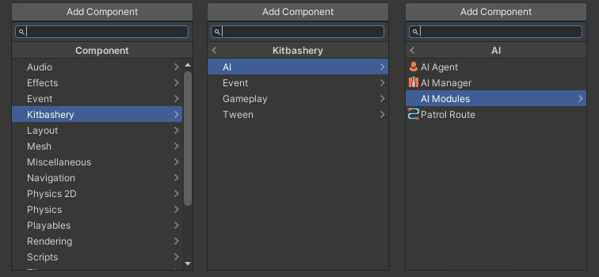
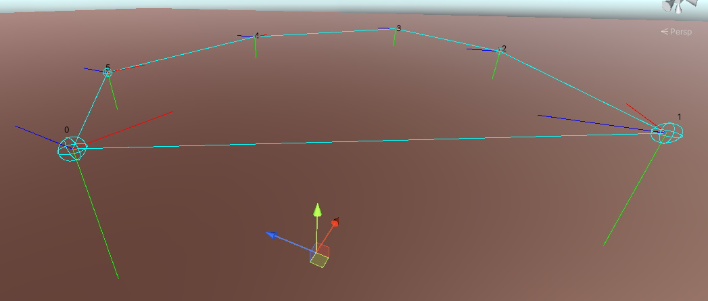

# Modular AI

## Description:
Modular AI is an inspector based visual behaviour designer.

### Namespace:
Kitbashery.AI

## Features:
* Implements competeing utility theory behaviours for dynamic AI behaviours.
* Zero string comparisons or calls to reflection.
* Behaviours can be fully configured during runtime.
* Not tied to a specific pathfinding solution.
* Fully extendable via code modules.

### Built-in Modules:

#### Unity Pathfinding:
* Flee/Follow
* Wander
* Patrol

#### Memory:
* Remember players, AI agents or environment objects.
* Focus/target objects in memory
* Invoke custom events.

#### Sensors:
* Eye level scans
* Physics Scan Options for 2D & 3D
* Integrated with memory

#### Animation:
* Idle, Walk, Run & Jump
* Attack, Death Animations
* Dynamic Hit reactions

# Getting Started:
To get started using Modular AI first create a GameObject with an AIManager component.

All Modular AI components can be found through the component menu:



Next create a new GameObject with an AIAgent component and add the modules you want to it.
Modules contain code that defines behaviour logic the AI can use & can be configured using the inspector.


## Utility Theory:

Modular AI uses utility theory for its AI behaviour logic. An AI agent can have as many behaviours as you want.

### Behaviours:
Behaviours are comprised of conditions and actions and have a score value. The behaviour with the score that best meets the score type you set will execute its actions.
### Conditions:
Conditions are true/false statements based on what the AI knows about the game world. If a condition meets its desired state then it will add its score to the behaviour's total score.
### Actions:
Actions are executed in the order they are arranged if a behaviour's total score meets the score type better than any other behaviour.


## Module Scripting:
Take a look at [ExampleModule.cs](https://kitbashery.com/docs/modular-ai/example-module.html) for how to create your own modules.

# CLASSES:

# AIAgent.cs

## Description:
Contains a list of behaviours that can be evaluated.

## Usage Notes:

An AI agent's behaviour loop is updated by an instance of `AIManager` if a manager instance is not found one will be created.

## Public Properties:

| Type        | Name | Description         | Default Value |
|:-------------|:----|:------------------|:------|
|  `AIModule[]` | modules |  |  |
|  `bool` | modulesChanged | Has the amount of modules changed? | false |
|  `List<AIBehaviour>` | behaviours |  |  |
|  `UnityEvent` | preActionExecution | Events to be invoked before any behaviour actions are executed when `ExecuteWinningBehaviourActions()` is called. |  |
|  `UnityEvent` | postActionExecution | Events to be invoked after any behaviour actions are executed when `ExecuteWinningBehaviourActions()` is called. is called. |  |
|  `bool` | debugMode | Toggles debug information in the console while in playmode. | false |
|  `DebugLevels` | debugLevel | How much information to log to the console while in debug mode. | DebugLevels.BehavioursOnly |
|  `ScoreTypes` | scoreType | The condition a behaviour's score needs to meet for its actions to execute. | ScoreTypes.HighestScoreWins |
|  `int` | scoreThreshold | The score a behaviour will need to beat in order for its actions to be executed. | 0 |
|  `bool` | hasBrokenReferences | Has a module that this agent depends on been removed? | false |

## Public Methods:

| Name | Summary      | Parameters | Returns |
|:----|:------------------|:-----------|:--------|
| UpdateAI |  |  | `Void` |
| ResetBehaviourEvaluation | Resets the initial score to beat and clears previously winning behaviours. Note: Call this if you change `scoreType` during runtime. |  | `Void` |
| ExecuteBehaviourActions |   | `AIBehaviour` behaviour | `Void` |
| AddNewEvent |   | `int` behaviourIndex, `BehaviourEvent` behaviourEvent | `Void` |
| ValidateBehaviours | Makes sure all components required by the behaviour logic has a component instance. |  | `Void` |
| FixBrokenReferences |  |  | `Void` |
| CheckForModuleChanges |  |  | `void` |


## Enumerations:

### DebugLevels

`{ All, BehavioursOnly, ConditionsOnly }`

### ScoreTypes

`{ AllScoresAboveThreshold, FirstScoreAboveThreshold, FirstScoreWins, HighestScoreWins, LowestScoreWins }`

# AIAgentEditor.cs

## Description:
Custom editor for [AIAgent.cs](https://kitbashery.com/docs/modular-ai/ai-agent.html)

## Public Properties:

| Type        | Name | Description         | Default Value |
|:-------------|:----|:------------------|:------|
|  `AIAgent` | self |  | The `AIAgent` being inspected. |

## Public Methods:

| Name | Summary      | Parameters | Returns |
|:----|:------------------|:-----------|:--------|
| OnInspectorGUI |  |  | `override Void` |

# AIManager.cs

## Description:
Consolidates `AIAgent` update loops improving performance.

## Usage Notes:
 
* Default script execution order is -21 to load before AIAgents.cs.
 

## Public Properties:

| Type        | Name | Description         | Default Value |
|:-------------|:----|:------------------|:------|
|  `static AIManager` | Instance |  |  |
|  `List<AIAgent>` | agents |  |  |

## Public Methods:

| Name | Summary      | Parameters | Returns |
|:----|:------------------|:-----------|:--------|
| Register |  | `AIAgent` agent | `Void` |
| Unregister |  | `AIAgent` agent | `Void` |

# AIModule.cs

## Description:
A base class for all AI modules.

## Usage Notes:

Components that inherit from this base class are automatically hidden in the editor. to prevent this comment out the `OnValidate() method:
```csharp
        private void OnValidate()
        {
            hideFlags = HideFlags.HideInInspector;
        }
```
Doing so will show modules as regular components in the inspector.
You may also wish to comment out the call to `DrawModules();` in the `OnInspectorGUI()` funciton in `AIAgentEditor.cs` this will prevent the custom module UI from being displayed.

## Public Properties:

| Type        | Name | Description         | Default Value |
|:-------------|:----|:------------------|:------|
|  `abstract string[]` | conditions |  |  |
|  `abstract string[]` | actions |  |  |

## Public Methods:

| Name | Summary      | Parameters | Returns |
|:----|:------------------|:-----------|:--------|
| executeAction |  | `int` actionIndex | `abstract Void` |
| checkCondition |  | `int` conditionIndex | `abstract Void` |

# AnimationModule.cs

### Inherits from:
[AIModule.cs](https://kitbashery.com/docs/modular-ai/ai-module.html)

## Description:
This module contains actions and condtions to play animations via Unity's `Animator` component.

## Usage Notes:

The tags "Player" and "Agent" are used by this module by default make sure they exist in your project settings if you use them.

## Public Properties:

| Type        | Name | Description         | Default Value |
|:-------------|:----|:------------------|:------|
|  `UnityEvent` | animationEvents |  |  |
|  `Animator` | anim | The `Animator` component. |  |
|  `List<GameObject>` | players |  |  |
|  `string` | idleState |  |  |
|  `string` | walkState |  |  |
|  `string` | runState |  |  |
|  `string` | jumpState |  |  |
|  `string[]` | deathStates |  |  |
|  `int` | currentDeathState |  | -1 |
|  `string[]` | attackStates |  |  |
|  `int` | currentAttackState |  | -1 |
|  `string[]` | hitReactionStates |  |  |
|  `int` | currentHitReactionState |  | -1 |


## Public Methods:

| Name | Summary      | Parameters | Returns |
|:----|:------------------|:-----------|:--------|
| Idle |  | | `Void` |
| Walk |  | | `Void` |
| Run |  | | `Void` |
| Jump |  | | `Void` |
| Die |  | `StateOptions` option | `Void` |
| Attack |  | `StateOptions` option | `Void` |
| HitReaction |  | `StateOptions` option | `Void` |


## Enumerations:

### FocusModes

`{ Nearest, Farthest, Random, First, Last }`

# BehaviourEvent.cs

### Implements:
`IComparable<BehaviourEvent>`

## Description:
Represents an action or condition that will be executed or evaluated by `AIAgent`.

## Usage Notes:
Contains two constructors one for defining the event as a condition and a shorter one to set the event as an action.

## Public Properties:

| Type        | Name | Description         | Default Value |
|:-------------|:----|:--------------------|:--------------|
|  `AIModule` | instance | The required module component instance that this event links to during runtime.|  |
|  `string` | moduleName | The assembly qualified name the required module instance. |  |
|  `int` | id | ID is the index of either an action or condition. |  |
|  `string` | name | The name of the event. |  |
|  `bool` | isCondition |  Does this event represent a condition? |  |
|  `int` | score | The score value of the event if the event represents a condition. |  |
|  `bool` | state | The required state of the event if the event represents a condition. |  |

## Constructors:

| Summary      | Parameters | Constructs    |
|:-------------|:-----------|:--------------|
| Constructs an event as a condition. | `string` eventName, `int` eventID, `AIModule` module, `int` conditionScore, `bool` conditionState | `BehaviourEvent` |
| Constructs an event as an action. | `string` eventName, `int` eventID, `AIModule` module | `BehaviourEvent` |

## Public Methods:

| Name | Summary      | Parameters | Returns |
|:----|:--------------|:-----------|:--------|
| CompareTo | Required by IComparable. | `BehaviourEvent` other | `int` |

# ExampleModule.cs

### Inherits from:
[AIModule.cs](https://kitbashery.com/docs/modular-ai/ai-module.html)

## Description:
This class is an example template for creating modules.

## Usage Notes:
* All classes that inherit from [AIModule.cs](https://kitbashery.com/docs/modular-ai/ai-module.html) should have the `[DisallowMultipleComponent]` attribute.

* Overrides for `conditions` and `actions` of AIModule.cs are required, however can be encapsulated in `#if UNITY_EDITOR` if you do not want to use them to build UI dropdowns for runtime behaviour editing.

* Make sure you don't have any AIAgents selected in the inspector when you make changes to the `conditions` or `actions` arrays this may break the dropdown for that inspected agent. See [Issue #6](https://github.com/Kitbashery/Modular-AI/issues/6) in modular AI's GitHub repo for more information. A workaround for this is to reset the module component.

* Do not rearrange the strings entered into an action/condition override array once they are in use in your project this will cause visual bugs in the editor.

```csharp

using System.Collections;
using System.Collections.Generic;
using UnityEngine;

namespace Kitbashery.AI
{
    [HelpURL("https://kitbashery.com/docs/modular-ai/example-module.html")]
    [DisallowMultipleComponent]
    [AddComponentMenu("Kitbashery/AI/AI Modules/ExampleModule.cs")]
    public class ExampleModule : AIModule
    {
        #region Properties:

        [Header("ExampleModule.cs is a template script for programming reference.")]
        [Header("Example Inpector Header")]
        [Tooltip("Example Inspector Tooltip")]
        public int exampleVariable;

        #endregion

        #region Modular AI Condition Overrides:

        /// <summary>
        /// Condition names used by the editor to set identifiers based on the index of 
        /// the selected string in this array.
        /// </summary>
        private string[] _conditions;
        public override string[] conditions
        {
            get
            {
                if (_conditions == null || _conditions.Length == 0)
                {
                    _conditions = new string[3] { "example condition 1", "example condition 2", "example condition 3" };
                }
                return _conditions;
            }
        }

        /// <summary>
        /// Checks a condition based on an index that should match an action's name in this module's actions array.
        /// </summary>
        /// <param name="conditionIndex"></param>
        public override bool checkCondition(int conditionIndex)
        {
            switch (conditionIndex)
            {
                case 0:

                    // This is an example of returning a statement.
                    return transform.position == Vector3.zero;

                case 1:

                    // This is an example of how you could return a more complex statement.
                    if (transform.position == Vector3.zero && (transform.position.y > 1 || transform.position.y < 0))
                    {
                        return true;
                    }
                    else
                    {
                        return false;
                    }

                case 2:

                    // This is an example of how to return a boolean value from a method 
                    // (useful for managing more complex code such as loops).
                    return ConditionExample3();

            }

            return false;
        }

        #endregion

        #region Modular AI Action Overrides:

        /// <summary>
        /// Action names used by the editor to set identifiers based on the index of 
        /// the selected string in this array.
        /// </summary>
        private string[] _actions;
        public override string[] actions
        {
            get
            {
                if (_actions == null || _actions.Length == 0)
                {
                    _actions = new string[2] { "do something", "do another thing" };
                }
                return _actions;
            }
        }

        /// <summary>
        /// Executes an action based on an index that should match an action's name in this module's actions array.
        /// </summary>
        /// <param name="actionIndex"></param>
        public override void executeAction(int actionIndex)
        {
            switch (actionIndex)
            {
                case 0:

                    // Do someting.

                    break;

                case 1:

                    // Do another thing.

                    break;
            }
        }

        #endregion

        #region Initialization & Updates:

        // All standard Monobehaviour updates can go here such as Start() and Update().

        #endregion

        #region Methods:

        public bool ConditionExample3()
        {
            for(int i = 0; i < 10; i++)
            {
                if(i > 5)
                {
                    return true;
                }
            }

            return false;
        }

        #endregion
    }
}
```

# MAI_EditorUtility.cs

## Description:
Utility class for drawing commonly used editor GUI elements for modular AI's custom inspectors.

## Public Properties:

| Type        | Name | Description         | Default Value |
|:-------------|:----|:------------------|:------|
|  `static GUIStyle` | centeredBoldHelpBox |  |  |
|  `static GUIStyle` | wrappedMiniLabel |  |  |
|  `static GUIStyle` | miniLabel |  |  |
|  `static GUIStyle` | centeredMiniLabel |  |  |
|  `static GUIStyle` | upperLeftMiniLabel |  |  |
|  `static GUIStyle` | centeredLabel |  |  |
|  `static GUIStyle` | centeredBoldLabel |  |  |
|  `static GUIStyle` | middleLeftBoldLabel |  |  |
|  `static GUIStyle` | lowerLeftBoldLabel |  |  |
|  `static GUIStyle` | clippingBoldLabel |  |  |
|  `static GUIStyle` | rightAlignedLabel |  |  |
|  `static GUIStyle` | richText |  |  |
|  `static GUILayoutOption[]` | horizontalLine |  |  |
|  `static GUILayoutOption[]` | thickHorizontalLine |  |  |


## Public Methods:

| Name | Summary      | Parameters | Returns |
|:----|:------------------|:-----------|:--------|
| DrawHelpTitleToggle | Draws a bold title with a help button that toggles a help box. Useage example: `myBool = DrawHelpTitleToggle(myBool, "title", "message");` | `bool` toggle "Boolean to pass in and return.", `string` title "Text for the bold title.", `string` text "Text for the help box to display." | `static bool` "Returns toggle" |
| DrawFoldout |  | `bool` value, `string` label | `static bool` |
| DrawCompactPopup |   | `string` label, `int` value, `string[]` options | `static int` |
| DrawComponentOptions |   | `Component` component | `static Void` |

# MemoryModule.cs

### Inherits from:
[AIModule.cs](https://kitbashery.com/docs/modular-ai/ai-module.html)

## Description:
This module contains actions and condtions to remember `GameObject`s and `AIAgent`s that it has been made aware of in the environment.

## Usage Notes:

The tags "Player" and "Agent" are used by this module by default make sure they exist in your project settings if you use them.

## Public Properties:

| Type        | Name | Description         | Default Value |
|:-------------|:----|:------------------|:------|
|  `List<GameObject>` | objects |  |  |
|  `List<AIAgent>` | agents |  |  |
|  `List<GameObject>` | players |  |  |
|  `GameObject` | objectFocus |  |  |
|  `AIAgent` | agentFocus |  |  |
|  `GameObject` | playerFocus |  |  |
|  `string` | focusTag |  |  |
|  `string` | agentTag |  | "Agent" |
|  `string` | playerTag |  | "Player" |


## Public Methods:

| Name | Summary      | Parameters | Returns |
|:----|:------------------|:-----------|:--------|
| FocusOnGameObject |  | `FocusModes` focusMode | `Void` |
| FocusOnAgent |  | `FocusModes` focusMode | `Void` |
| FocusOnPlayer |  | `FocusModes` focusMode | `Void` |
| AddObjectToMemory |  | `GameObject` go | `Void` |
| AddAgentToMemory |  | `AIAgent` agent | `Void` |
| FindAgentsInEnvironmentMemory | Finds all `AIAgent`s in `objects` and moves them to `agents`. |  | `Void` |
| FindPlayersInEnvironmentMemory | Finds all GameObjects tagged as a player in `objects` and moves them to `players`. |  | `Void` |


## Enumerations:

### FocusModes

`{ Nearest, Farthest, Random, First, Last }`

# PathfindingModule.cs

### Inherits from:
[AIModule.cs](https://kitbashery.com/docs/modular-ai/ai-module.html)

## Description:
Module that defines actions and conditions for a `AIAgent` to pathfind using Unity's built-in `NavMeshAgent`.

## Usage Notes:

An AI agent's behaviour loop is updated by an instance of `AIManager` if a manager instance is not found one will be created.

## Public Properties:

| Type        | Name | Description         | Default Value |
|:-------------|:----|:------------------|:------|
|  `bool` | debugMode | Toggles debug mode for displaying gizmos when the agent is selected. | false |
|  `NavMeshAgent` | agent |  |  |
|  `Transform` | target | The target location for the agent to pathfind to. |  |
|  `MemoryModule` | memory |  |  |
|  `PatrolRoute` | patrolRoute | Positions representing a patrol route in the order they should be navigated to. |  |
|  `float` | fleeDistance | How far the agent should flee from a target. | 16 |
|  `float` | followDistance | How far from a target the agent need to be to follow it. | 4 |
|  `float` | wanderRange | How far can this agent wander? | 4 |
|  `float` | wanderTime | How long the agent should wait until it wanders again. | 1.5f, Minimum Value = 0 |
|  `float` | patrolWaitTime | The time the agent waits before moving to the next waypoint. | 0 |
|  `int` | timesToPatrol | How many times the agent should patrol though its waypoint route. (0 = forever) | 0 |
|  `PatrolTypes` | patrolType |  | 0 |
|  `int` | timesPatroled |  | PatrolTypes.loop |

## Public Methods:

| Name | Summary      | Parameters | Returns |
|:----|:------------------|:-----------|:--------|
| Flee |  |  | `Void` |
| FollowTarget | |  | `Void` |
| Idle |   |  | `Void` |
| MoveToTarget |   |  | `Void` |
| StopPatrol |  |  | `Void` |
| Patrol |  |  | `Void` |
| Wander |  |  | `void` |

# PatrolRoute.cs

## Description:
Defines a patrol route relative to its parent `Transform`.

## Usage Notes:

An AI agent's behaviour loop is updated by an instance of `AIManager` if a manager instance is not found one will be created.

## Public Properties:

| Type        | Name | Description         | Default Value |
|:-------------|:----|:------------------|:------|
|  `Vector3[]` | waypoints | Waypoints that define a patrol route in the order they should be navigated to. Note: waypoints are fixed positions in world space. |  |
|  `Vector3[]` | route | The patrol route relative to it's transform (waypoints in local space). Note: route move with the transform. |  |
|  `RaycastHit[]` | hits | Hits chached when randomizing waypoints. |  |

## Public Methods:

| Name | Summary      | Parameters | Returns |
|:----|:------------------|:-----------|:--------|
| RefreshPatrolRoute | Refreshes the patrol route based on the current waypoint and transform position. |  | `Void` |
| RandomizeWaypoints | `float` radius, `float` maxDistance, `LayerMask` mask, `QueryTriggerInteraction` triggerInteraction |  | `Void` |

## Enumerations:

### PatrolTypes

`{ loop, pingPong, randomize }`

## Gizmo Preview:



# SensorModule.cs

### Inherits from:
[AIModule.cs](https://kitbashery.com/docs/modular-ai/ai-module.html)

## Description:
This module defines actions and conditions for a `AIAgent` to be able to detect `GameObject`s in the environment.

## Public Properties:

| Type        | Name | Description         | Default Value |
|:-------------|:----|:------------------|:------|
|  `bool` | debugMode | Toggles debug mode for displaying gizmos when the agent is selected. | false |
|  `Transform` | eyes | Where to start the ray from when scanning via raycasts. |  |
|  `MemoryModule` | memory |  |  |
|  `LayerMask` | layerMask | Layers to scan for objects on. | -1 |
|  `QueryTriggerInteraction` | triggerInteraction | Should trigger colliders be ignored? See QueryTriggerInteraction in the Unity Manual. | QueryTriggerInteraction.Ignore |
|  `SensorTypes` | sensorType |  | SensorTypes.sphere |
|  `float` | scanRange | The scan range or bounds of the AI's sensor; A minium of twice the NavMeshAgent's height is recommended. | 4 |
|  `float` | scanInterval | Determines the delay between scans. | 0 |
|  `List<string>` | searchFilterTags | Scans of the environment will only add GameObjects with these tags to memory. |  |
|  `bool` | clearOldMemory | Determines if any existing memory should be cleared before each new scan. (may increase performance, but be careful that clearing memory doesn't impact gameplay) | false |


## Public Methods:

| Name | Summary      | Parameters | Returns |
|:----|:------------------|:-----------|:--------|
| Scan | Scans for `GameObject`s in the scene. | `ScanTypes` scanType | `Void` |


## Enumerations:

### SensorTypes

`{ sphere, box, ray, _2D_circle, _2D_box, _2D_line }`

### ScanTypes

`{ environment, players, agents, environmentFiltered }`


# Support:
Need support or additional features? Please visit https://kitbashery.com/
