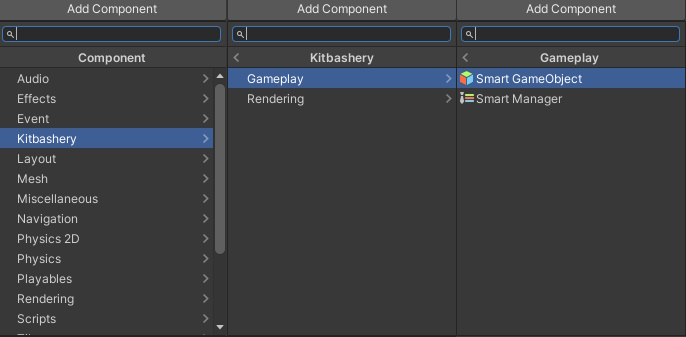
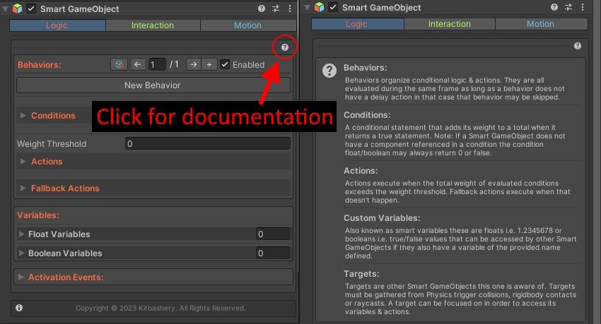

# Getting Started:

### Creating a Smart GameObject:
Right-click the hierarchy and navigate to Kitbashery > Smart GameObject If a Smart Manager is not in the scene one will be automatically created.

Alternatively on an existing GameObject you can navigate to Add Component > Kitbashery > Gameplay > Smart GameObject and add it as a component.

Make sure there is a Smart Manager present in any scene with a SmartGameObject in it.

---

### Built-in Documentation:
Detailed instructions can be found by clicking the (?) button under the component's header for each component or component section.

Nearly every field will have a tooltip if you hover over it as well.

---

### FAQ:

**Q) How can I get a behavior to run only once?**

**A)** Disable the behavior by adding the "Disable Behavior" action at the end of your actions and provide the page number of the behavior - 1

**Q) How can I create new actions or integrate other assets?**

**A)** Actions are hard-coded. It is recommended to use UnityEvents for that. If you want a new action please submit a feature request.

**Q) I get warnings after I compile while in play mode, why?**

**A)** Disable runtime compiling in your editor preferences, compiling in play mode messes with the SmartManager instance.

**Q) My Smart Mesh has stretched/wavy UVs, why?**

**A)** This is because of Unity's mesh data structure, there may be overlapping UV triangles.
Seams could be fixed by duplicating vertices along seams. This may be improved in future versions.

---

### Optimization Tips:

Like all visual scripting solutions, the output will be less efficient than hand-crafted code.
To ensure your project runs smoothly take try to follow these guidelines:

1) Limit the use of "Delay Next Action" actions, although optimized these use coroutines which generate garbage.

2) Limit the use of Tweens, the evaluation function of animation curves can generate garbage.

3) Limit the use of UnityEvents these calls use reflection under the hood instead use SmartActions when you can.

4) If you have a consistent FPS at or below 30 you may be able to achieve 30-60 again by enabling FPS throttling.

5) Avoid using distance checks or pathfinding actions without a condition since they can be computationally expensive.

6) Use the SmartManager's object pools to instantiate objects via spawn actions when many duplicate objects are needed.
